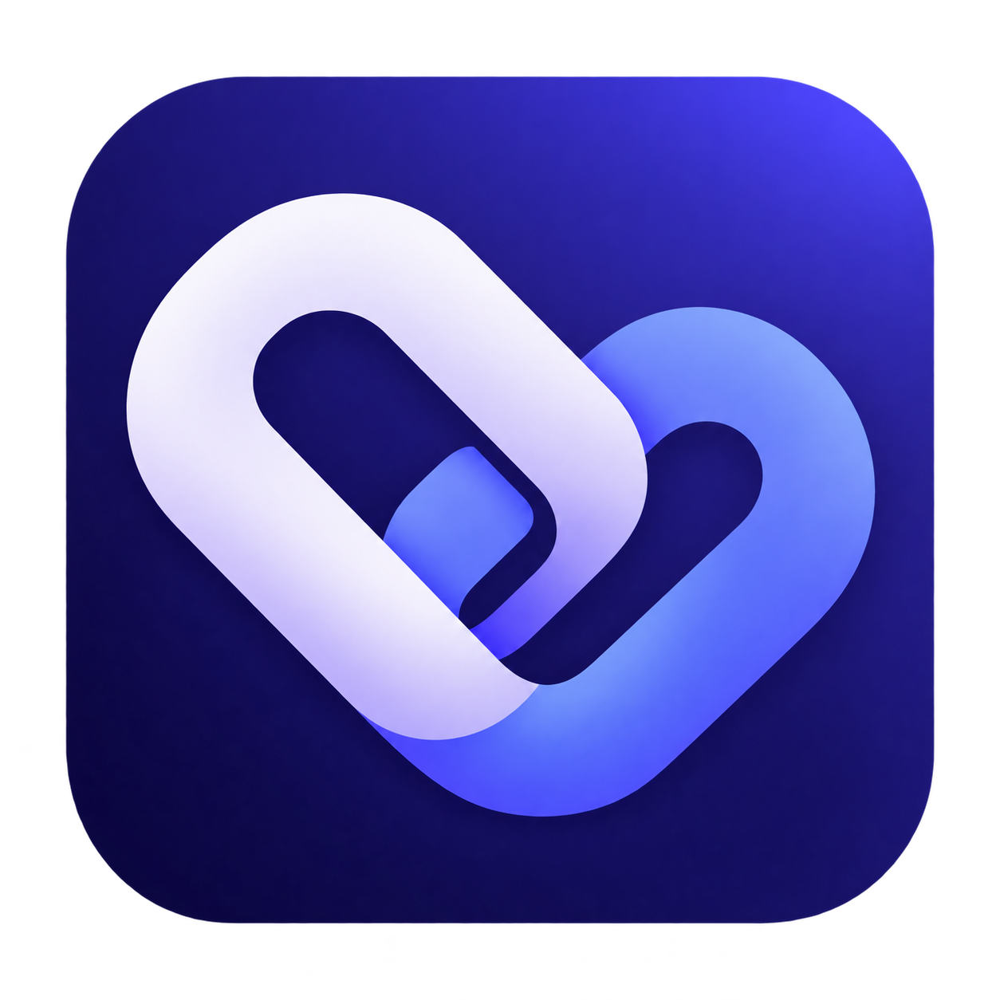
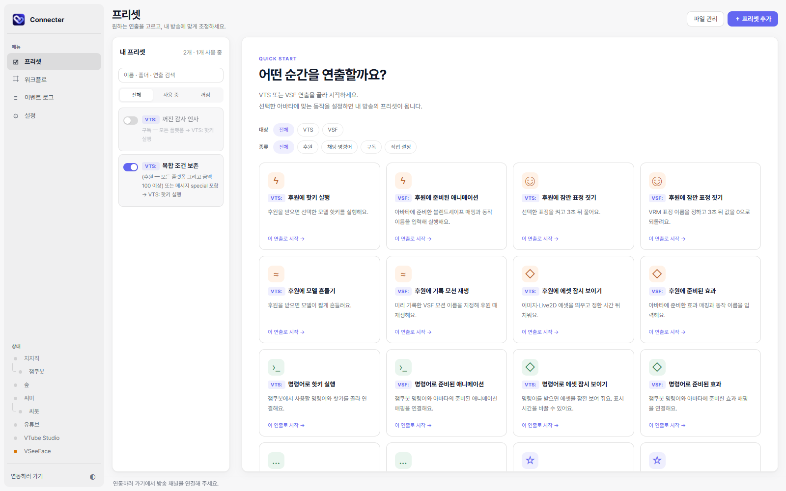
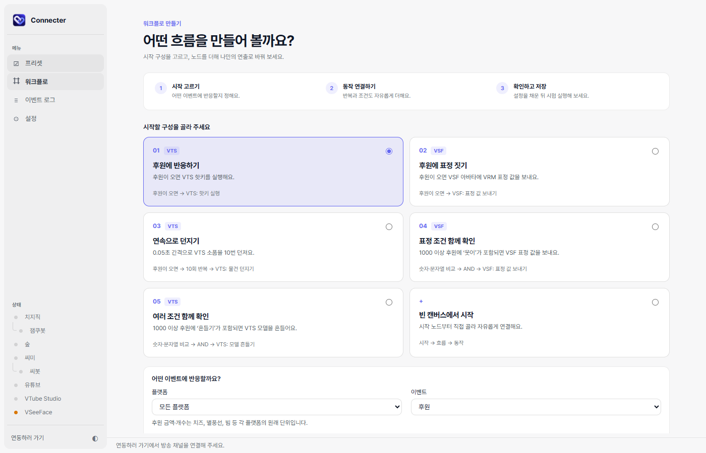
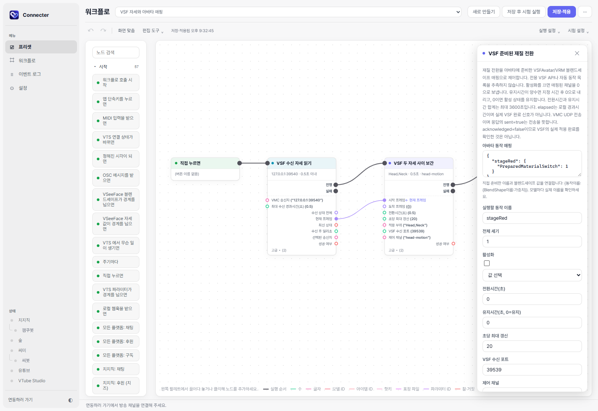

<h1 align="center">VT Connecter</h1>

방송 이벤트를 버추얼 아바타의 반응으로 연결하는 Windows 앱

치지직·숲(SOOP)·씨미(ci.me)·유튜브의 **채팅, 후원, 구독** 등을 받아 **VTube Studio(VTS)** 또는 **VSeeFace(VSF)** 아바타를 움직입니다. 코드를 쓰지 않고 프리셋으로 시작하거나, 노드를 연결해 나만의 방송 연출을 만들 수 있습니다.

**[최신 버전 다운로드](https://github.com/so0420/vt-connecter-releases/releases/latest)** — Assets에서 이름이 `x64-setup.exe`로 끝나는 설치 파일을 다운로드하세요.

## 무엇을 할 수 있나요?

- **프리셋으로 빠르게 시작** — 후원에 핫키 실행, 표정 변경, 모델 흔들기, 소품·효과 표시 등을 설정합니다.
- **VTS와 VSF 선택** — VTS 핫키·표정·소품과 VSF VRM 표정·기록 모션·준비된 애니메이션을 각각 지원합니다.
- **워크플로 만들기** — 이벤트, 조건, 반복, 확률, 변수와 동작 노드를 연결하고 직접 시험 실행합니다.
- **방송 도구 연동** — OBS 장면 전환, MIDI·OSC 입력, 웹훅 등의 이벤트와 동작을 함께 사용할 수 있습니다.

## 화면 미리 보기

### VTS / VSF 프리셋

### 워크플로 시작 구성

### VSF 노드 편집

## 시작하기

1. [최신 릴리스](https://github.com/so0420/vt-connecter-releases/releases/latest)의 **Assets**에서 이름이 **`x64-setup.exe`**로 끝나는 설치 파일을 다운로드해 실행합니다. `vt-connecter.exe`는 설치 파일이 아닙니다.
2. 앱의 **설정 → 플랫폼 연결**에서 사용할 방송 플랫폼을 연결합니다.
3. **VTube Studio**의 Plugin API를 켜거나 **VSeeFace**의 VMC 송수신을 설정합니다.
4. **프리셋**에서 VTS / VSF 대상을 고르거나 **워크플로**에서 직접 노드를 연결합니다.

Windows x64와 WebView2 런타임이 필요합니다. 새 버전이 나오면 앱에서 알려 주며, 설치 시점은 직접 선택할 수 있습니다.

## 이용 조건

개인·상업 방송과 유료 커미션에 사용할 수 있습니다. 프로그램 자체의 재배포, 역공학 및 책임 범위는 [사용 허락 및 이용 조건](LICENSE.md)을 확인해 주세요.
